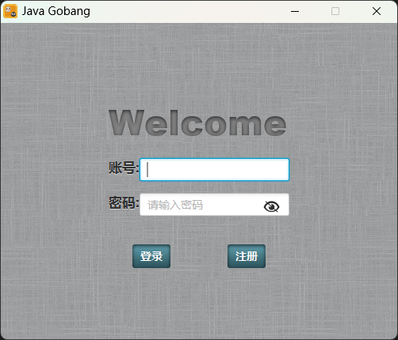
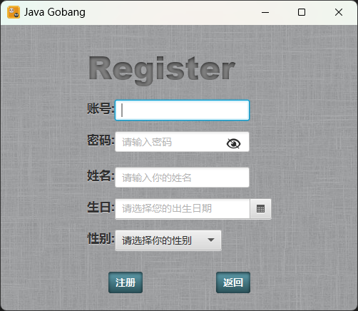
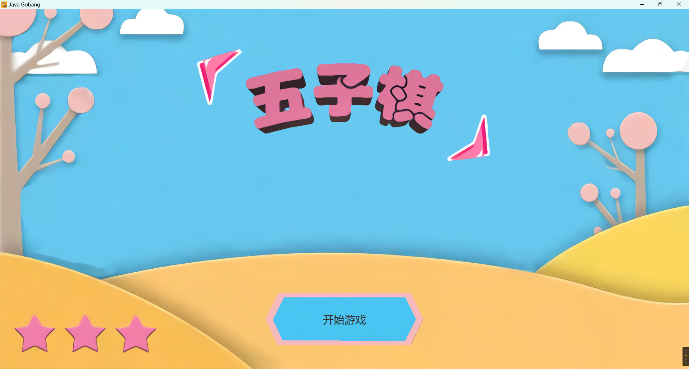
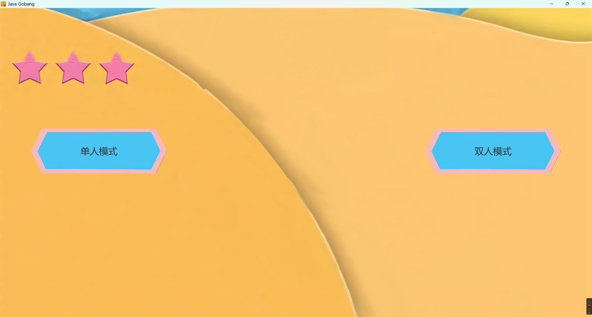
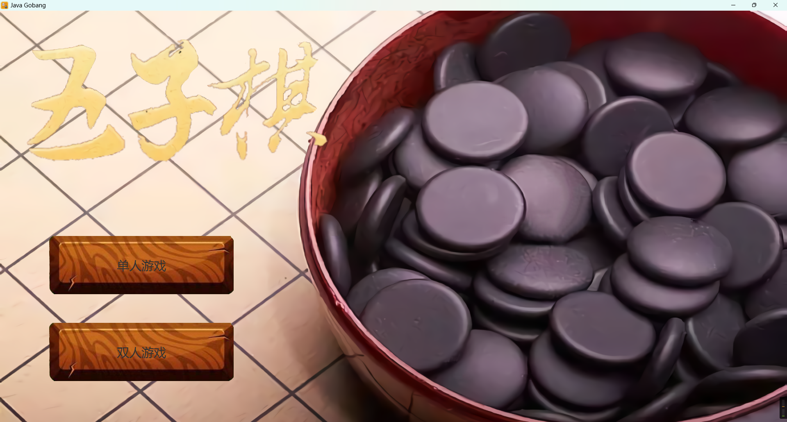
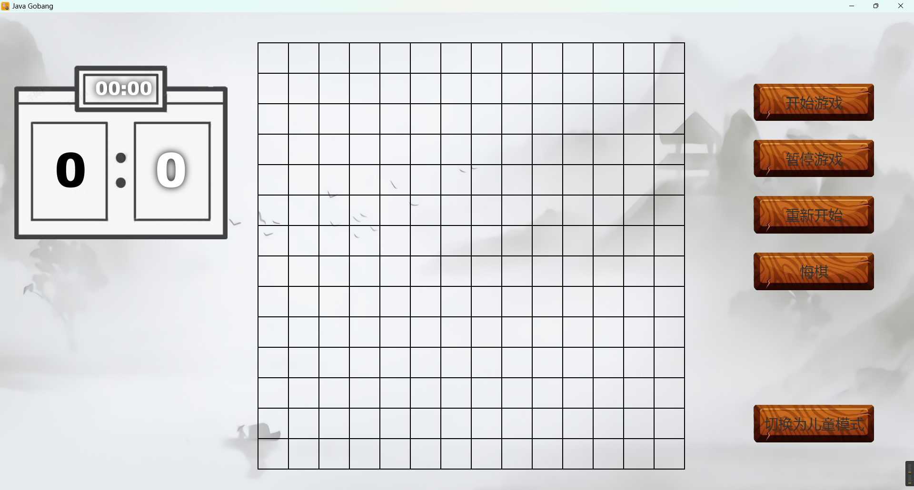
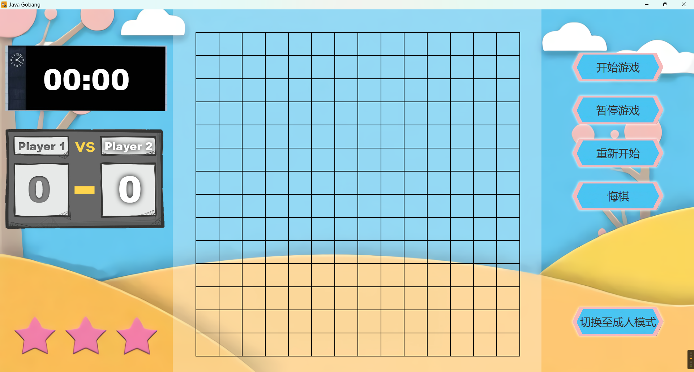
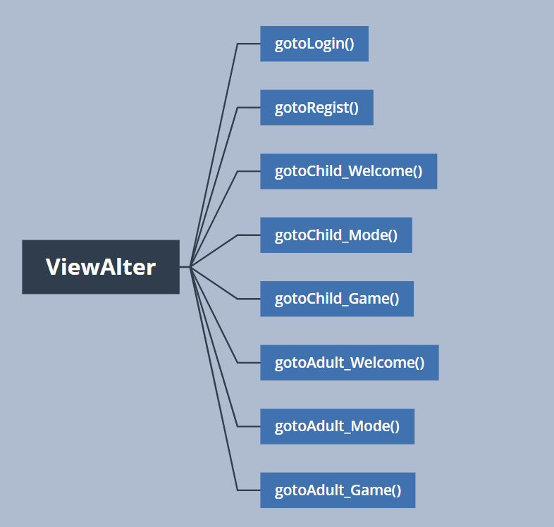
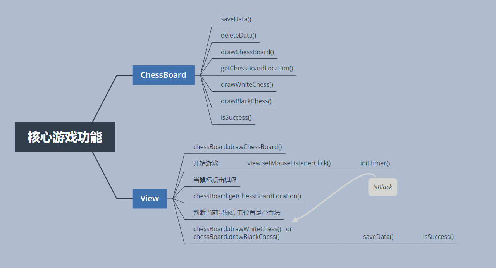

# Java五子棋

> 大一下期末大作业

## 项目截图

登录
 

注册


开始界面




模式选择





单人游戏




双人游戏




## 项目亮点

1. 一共编写了两套页面，根据用户年龄智能匹配适合的页面
1. 支持单人、双人游戏

## 优势

1. 页面美观
2. 代码结构清晰，易于修改

## 代码实现

> 基于JavaFX和JavaSE

### 登录功能

1. 校验输入的信息是否完整
2. 扫描根目录下的user文件夹，将文件夹下的XML文件反序列化为user对象
3. 对输入的密码进行SHA-256加密，判断与保存的密码是否一致
4. 判断用户年龄 `若年龄小于等于12则判断为儿童，反之则成人`

```java
public void login_Button_Login() {
   FileInputStream fileInputStream;
   String login_user_account;
   String login_user_password;
   try {
      login_user_account = textf_Login_Account.getText();
      String type = "SHA-256";
      if (login_Button_isShow_tmp == 0) {
         /*
          * 对密码进行SHA-256加密
          */
         System.out.println("passwordf");
         login_user_password = HashEncryption.sign(passwordf_Login_Password.getText(), type);
      } else {
         /*
          * 对密码进行SHA-256加密
          */
         login_user_password = HashEncryption.sign(textf_Login_Password.getText(), type);
      }
   } catch (Exception e) {
      e.printStackTrace();
      /*
       * 判断用户输入的信息是否完整
       */
      messageDialog.showDialog("提示", "登录失败！！", "请检查您输入的信息是否完整", StaticResourcesConfig.ICON_IMAGE_PATH, null);
      return;
   }
   /*
    * 加载账户信息
    */
   RegisterAccount registerAccount = new RegisterAccount();
   try {
      fileInputStream = new FileInputStream(StaticResourcesConfig.USER_DATA_PATH + login_user_account + ".dat");
   } catch (FileNotFoundException e) {
      e.printStackTrace();
      messageDialog.showDialog("提示", "登录失败！！", "您登录的账户名不存在，请注册后再试", StaticResourcesConfig.ICON_IMAGE_PATH, null);
      return;
   }
   /*
    * 取出用户信息
    */
   User login_User = (User) registerAccount.loadObject(fileInputStream);
   /*
    * 判断账户密码是否正确
    */
   if (!login_User.getPassword().equals(login_user_password)) {
      messageDialog.showDialog("提示", "登录失败！！", "密码错误,请检查后重试", StaticResourcesConfig.ICON_IMAGE_PATH, null);
      return;
   }
   /*
    * 将已登录用户的对象传给ViewAlter
    */
   viewAlter.set_Logged_User(login_User);
   /*
    * 根据生日计算年龄，若年龄小于等于12则判断为儿童，反之则成人
    */
   if (new GetAge().getAgeByBirth(viewAlter.getLogged().getBirthday()) <= 12 ) {
      viewAlter.gotoChild_Welcome();
   } else {
      viewAlter.gotoAdult_Welcome();
   }

}
```

### 注册功能

1. 校验输入的信息是否完整
2. 将输入的信息实例化为user对象
3. 对于密码进行SHA-256加密
4. 将该对象反序列化为XML文件保存在user目录下

```java
public void regist_Button_Regist() {
   MessageDialog messageDialog = new MessageDialog();
   FileOutputStream file_Out = null;
   String regist_user_account;
   String regist_user_password;
   String regist_user_name;
   Date regist_user_birthday;
   String regist_user_sex;
   try {
      /*
       * 获取用户注册信息
       */
      regist_user_account = textf_Regist_Account.getText();
      String type = "SHA-256";
      if (regist_Button_isShow_tmp == 0) {
         /*
          * 对密码进行SHA-256加密
          */
         regist_user_password = HashEncryption.sign(passwordf_Regist_Password.getText(), type);
      } else {
         /*
          * 对密码进行SHA-256加密
          */
         regist_user_password = HashEncryption.sign(textf_Regist_Password.getText(), type);
      }
      regist_user_name = textf_Regist_name.getText();
      regist_user_birthday = new GetAge().toDate(Date_Regist_Birthday.getValue());
      regist_user_sex = regist_Comb_Sex.getSelectionModel().getSelectedItem();
   } catch (Exception e) {
      /*
       * 判断用户输入的信息是否完整
       */
      e.printStackTrace();
      messageDialog.showDialog("提示", "注册失败！！", "请检查您填写的信息", StaticResourcesConfig.ICON_IMAGE_PATH, null);
      return;
   }
   /*
    * 获取已注册账号
    */
   File file = new File(StaticResourcesConfig.USER_DATA_PATH);
   File[] accountName = file.listFiles();
   /*
    * 检查账号名是否存在
    */
   for (int i = 0; i < Objects.requireNonNull(accountName).length; i++) {
      String account = accountName[i].toString().substring(StaticResourcesConfig.USER_DATA_PATH.length(), accountName[i].toString().indexOf(".dat"));
      if (account.equals(regist_user_account)) {
         messageDialog.showDialog("提示", "注册失败！！", "您注册的账户名已存在", StaticResourcesConfig.ICON_IMAGE_PATH, null);
         return;
      }
   }
   /*
    * 实例化User对象
    */
   User user = new User(regist_user_account, regist_user_password, regist_user_name, regist_user_birthday, regist_user_sex, null);
   RegisterAccount login_account = new RegisterAccount();
   try {
      file_Out = new FileOutputStream(StaticResourcesConfig.USER_DATA_PATH + regist_user_account + ".dat");
   } catch (FileNotFoundException e) {
      e.printStackTrace();
   }
   /*
    * 保存User对象
    */
   login_account.saveUser(user, file_Out);
   /*
    * 显示Dialog注册成功
    */
   if (messageDialog.showDialog("提示", "注册成功!!", null, StaticResourcesConfig.ICON_IMAGE_PATH, null) != 2) {
      viewAlter.gotoLogin();
   }
}
```

### 页面切换

ViewAlter类负责项目的启动、初始化页面和切换页面



### 核心游戏功能


